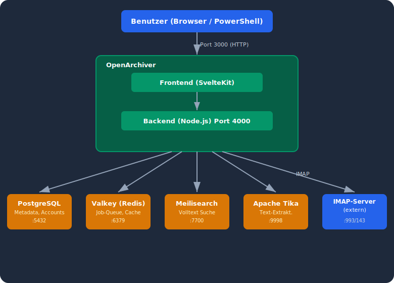
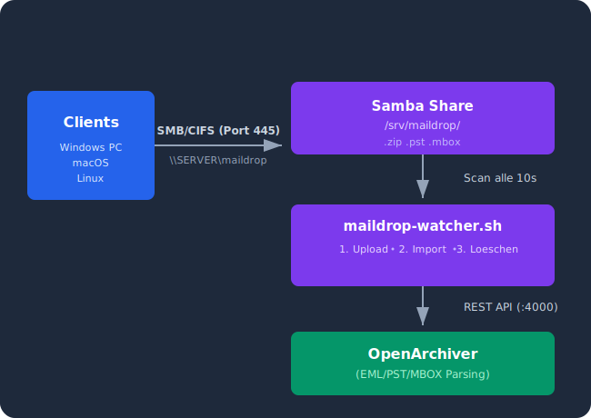
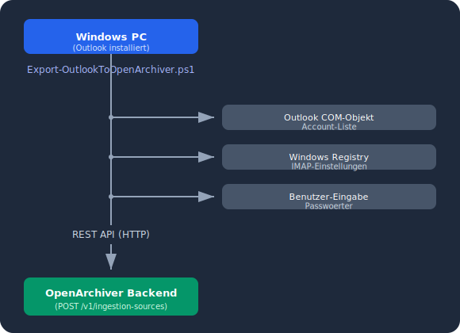
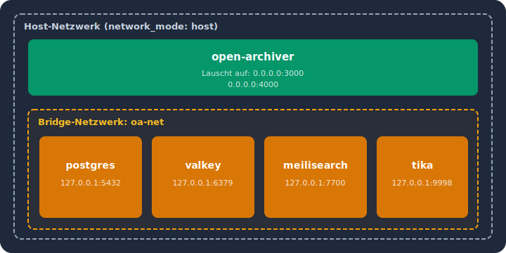

# Architektur

[Zurueck zur Startseite](./)

---

## Systemueberblick

<p align="center">
  
</p>

---

## Datenfluss

### 1. IMAP-Sync (automatisch)

<p align="center">
  
</p>

### 2. Proton Bridge (ueber TLS-Wrapper)

<p align="center">
  
</p>

**Warum ein TLS-Wrapper?**

Proton Bridge bietet IMAP nur mit STARTTLS an (Verbindung startet unverschluesselt, dann Upgrade). OpenArchivers IMAP-Library unterstuetzt STARTTLS nicht zuverlaessig. Der socat TLS-Wrapper uebersetzt:

- **Eingehend** (von OpenArchiver): Implizites SSL auf Port 11143
- **Ausgehend** (zu Bridge): Klartext TCP auf Port 1143

Das CA-Zertifikat wird via `NODE_EXTRA_CA_CERTS` in den Container gemountet.

### 3. Maildrop (Datei-Import)

<p align="center">
  
</p>

### 4. Windows PowerShell Import

<p align="center">
  
</p>

---

## Docker-Netzwerk

<p align="center">
  
</p>

OpenArchiver laeuft im **Host-Netzwerk** (`network_mode: host`), damit es direkt auf die Ports der anderen Container zugreifen kann. Die Support-Services (Postgres, Valkey, etc.) laufen in einem eigenen Bridge-Netzwerk und binden sich nur an `127.0.0.1`.

---

## Speicher-Layout

```
/data/openarchiver/storage/          # Host-Pfad (konfiguribar)
└── open-archiver/
    └── <email>-(<label>)-<source-id>/
        ├── emails/
        │   ├── <hash>.eml.enc      # Verschluesselte Email (AES-256)
        │   └── ...
        └── attachments/
            ├── <hash>-filename.ext  # Deduplizierte Anhaenge
            └── ...
```

- **Emails** werden mit AES-256 verschluesselt gespeichert (`STORAGE_ENCRYPTION_KEY`)
- **Anhaenge** werden dedupliziert (gleiche Datei = nur einmal gespeichert)
- **Metadaten** liegen in PostgreSQL (Absender, Betreff, Datum, Ordner, etc.)
- **Suchindex** liegt in Meilisearch (Volltext aus Body + Anhaengen via Tika)

---

## Verschluesselung

| Was | Wie | Key |
|-----|-----|-----|
| Gespeicherte Emails | AES-256 | `STORAGE_ENCRYPTION_KEY` |
| IMAP-Credentials (in DB) | AES-256 | `ENCRYPTION_KEY` |
| API-Authentifizierung | JWT (HMAC) | `JWT_SECRET` |
| IMAP-Verbindungen | SSL/TLS | Zertifikate der Provider |
| Proton Bridge | socat + CA-signed Cert | Lokale CA |

---

[Zurueck zur Startseite](./) | [Weiter: Proton Bridge](proton-bridge)
