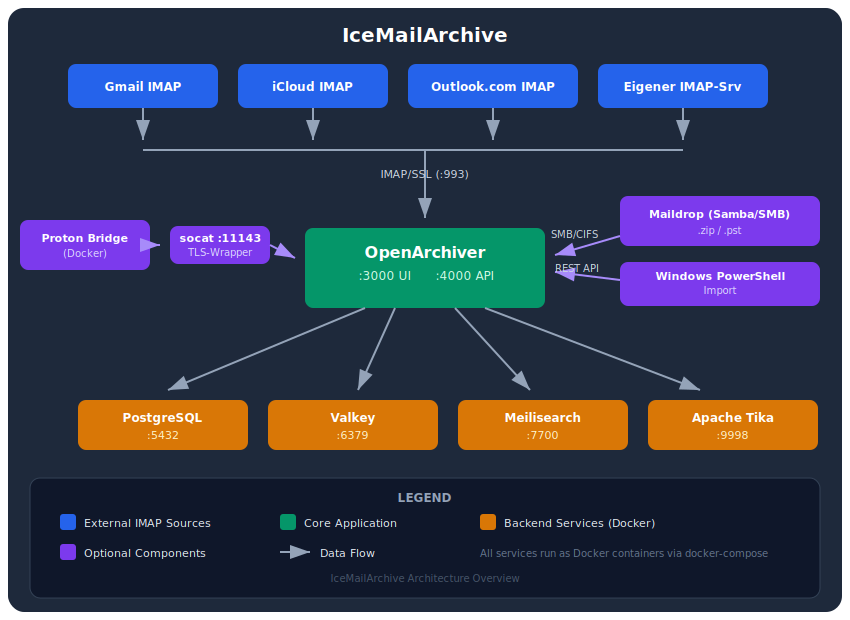

# IceMailArchive

**Self-hosted Email-Archivierung** - Alle Emails sicher, durchsuchbar und verschluesselt archivieren.

---

## Was ist IceMailArchive?

IceMailArchive ist eine schluesselfertige Loesung zur Email-Archivierung, basierend auf [OpenArchiver](https://github.com/logiclabshq/open-archiver). Das Projekt buendelt alle Komponenten, Konfigurationen und Hilfsskripte, die fuer eine produktive Email-Archivierung benoetigt werden.

<p align="center">
  
</p>

---

## Features

| Feature | Beschreibung |
|---------|-------------|
| **Multi-Account IMAP-Sync** | Gmail, iCloud, Outlook.com, GMX, Web.de, Posteo, Mailbox.org, u.v.m. |
| **ProtonMail** | Ueber Proton Bridge + TLS-Wrapper automatisch archivieren |
| **Maildrop (SMB)** | ZIP/PST/MBOX per Drag&Drop ueber Windows-Freigabe importieren |
| **Windows-Import** | PowerShell-Skripte lesen Outlook-Konten aus und importieren direkt |
| **Volltextsuche** | Meilisearch durchsucht Emails + Anhaenge (via Apache Tika) |
| **AES-256 Verschluesselung** | Gespeicherte Emails werden verschluesselt |
| **NFS-faehig** | Speicher auf NAS migrierbar (Synology, TrueNAS, etc.) |
| **Docker** | Ein `docker compose up -d` startet alles |

---

## Schnellstart

```bash
# 1. Repository klonen
git clone https://github.com/icepaule/IceMailArchive.git
cd IceMailArchive

# 2. Setup ausfuehren (erstellt .env, startet Stack)
sudo ./scripts/setup.sh

# 3. Browser oeffnen
# http://YOUR_SERVER_IP:3000
```

**Detaillierte Anleitung:** [Installation](installation)

---

## Komponenten

| Service | Image | Port | Funktion |
|---------|-------|------|----------|
| **OpenArchiver** | `logiclabshq/open-archiver:latest` | 3000, 4000 | Frontend + Backend |
| **PostgreSQL** | `postgres:17-alpine` | 5432 | Datenbank |
| **Valkey** | `valkey/valkey:8-alpine` | 6379 | Job-Queue + Cache |
| **Meilisearch** | `getmeili/meilisearch:v1.15` | 7700 | Volltextsuche |
| **Apache Tika** | `apache/tika:3.2.2.0-full` | 9998 | Text-Extraktion aus Anhaengen |
| **Proton Bridge** | `shenxn/protonmail-bridge:latest` | 1143, 1025 | ProtonMail IMAP (optional) |

---

## Dokumentation

- [Installation](installation) - Setup-Anleitung Schritt fuer Schritt
- [Konfiguration](configuration) - .env-Datei und Anpassungen
- [Architektur](architecture) - Technische Details und Datenfluss
- [Proton Bridge](proton-bridge) - ProtonMail einrichten
- [Maildrop](maildrop) - Samba-Share fuer Datei-Import
- [Windows-Import](windows-import) - PowerShell-Skripte fuer Outlook
- [NFS-Migration](nfs-migration) - Speicher auf NAS verlagern
- [Troubleshooting](troubleshooting) - Haeufige Probleme und Loesungen

---

## Projektstruktur

```
IceMailArchive/
├── docker-compose.yml              # Haupt-Stack (OA + DB + Suche + Tika)
├── docker-compose.proton.yml       # Proton Bridge (optional)
├── .env.example                    # Konfigurations-Template
├── scripts/
│   ├── setup.sh                    # Automatisches Setup
│   ├── maildrop-watcher.sh         # Datei-Import Daemon
│   ├── generate-tls-cert.sh        # TLS-Zertifikat fuer Proton Wrapper
│   ├── install-services.sh         # Systemd-Services installieren
│   └── migrate-to-nfs.sh           # Speicher auf NFS migrieren
├── systemd/
│   ├── maildrop-watcher.service    # Systemd Unit: Datei-Import
│   └── proton-tls-wrapper.service  # Systemd Unit: TLS-Proxy
├── samba/
│   └── maildrop.conf               # Samba-Share Konfiguration
├── windows/
│   ├── Export-OutlookToOpenArchiver.ps1  # Outlook -> OpenArchiver
│   └── Export-OutlookCredentials.ps1     # Outlook Credentials Export
└── docs/                           # Diese Dokumentation
```

---

*Erstellt mit [Claude Code](https://claude.com/claude-code) (Anthropic) auf einem Intel NUC mit Home Assistant.*
