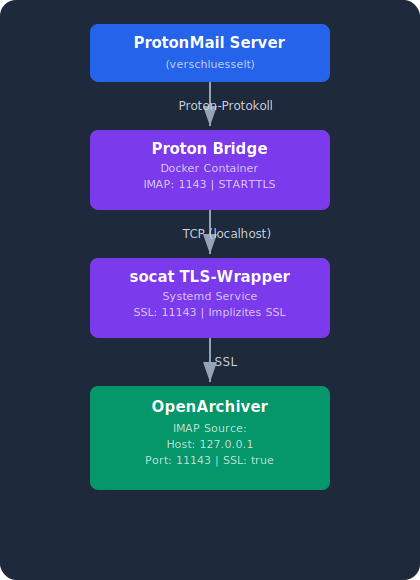
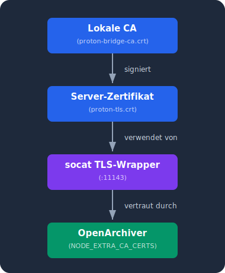

# Proton Bridge Integration

[Zurueck zur Startseite](./)

---

## Uebersicht

ProtonMail verschluesselt Emails Ende-zu-Ende - IMAP-Zugriff ist nur ueber die **Proton Bridge** moeglich. Die Bridge entschluesselt Emails lokal und stellt sie per IMAP/SMTP bereit.

<p align="center">
  
</p>

---

## Installation

### Schritt 1: Proton Bridge starten

```bash
docker compose -f docker-compose.proton.yml up -d
```

### Schritt 2: ProtonMail-Konto einloggen

```bash
# In den Container verbinden
docker exec -it proton-bridge bash

# Login ueber die CLI-Pipe
printf "login\nyour@protonmail.com\nYOUR_PASSWORD\n" > /protonmail/faketty

# Warten und Logs pruefen
docker logs proton-bridge --tail 20
```

Nach erfolgreichem Login zeigt die Bridge die **IMAP-Credentials** an:
- **Username:** meistens die Email-Adresse
- **Password:** ein generiertes Bridge-Passwort (NICHT das ProtonMail-Passwort!)

**Dieses Bridge-Passwort notieren** - es wird fuer OpenArchiver benoetigt.

### Schritt 3: TLS-Wrapper installieren

```bash
# Zertifikate generieren + Systemd-Service installieren
sudo ./scripts/install-services.sh --proton
```

Was passiert:
1. Lokale CA wird erstellt (10 Jahre gueltig)
2. Server-Zertifikat mit SAN `127.0.0.1` wird signiert
3. CA-Zertifikat wird ins Projekt kopiert (fuer Docker-Mount)
4. Systemd-Service `proton-tls-wrapper` wird gestartet

Pruefen:

```bash
# Service-Status
sudo systemctl status proton-tls-wrapper

# SSL-Verbindung testen
openssl s_client -connect 127.0.0.1:11143 </dev/null 2>/dev/null | head -5
```

### Schritt 4: In OpenArchiver einrichten

In der Web-UI (`http://SERVER:3000`):

1. **Ingestion Sources** > **New Source**
2. **Generic IMAP** waehlen
3. Einstellungen:

| Feld | Wert |
|------|------|
| Name | ProtonMail (user@protonmail.com) |
| Host | `127.0.0.1` |
| Port | `11143` |
| Username | user@protonmail.com |
| Password | *Bridge-Passwort aus Schritt 2* |
| Secure | `true` |

4. Speichern

---

## Warum STARTTLS nicht funktioniert

OpenArchivers IMAP-Library (`imapflow`) unterstuetzt STARTTLS nicht zuverlaessig:

- `secure: false` → "Unexpected close" (Server erwartet STARTTLS-Upgrade)
- `secure: true` → "packet length too long" (Client sendet SSL auf Klartext-Port)

Der socat TLS-Wrapper loest dieses Problem, indem er die Protokoll-Uebersetzung uebernimmt.

---

## Bekannte Probleme

### Bridge verliert Login nach Update

Proton Bridge versucht automatische Updates. Bei fehlenden Bibliotheken (z.B. `libfido2.so.1`) crashed die neue Version.

**Loesung:** Die Bridge direkt ueber den Binary-Pfad starten (nicht den Launcher):

```yaml
# In docker-compose.proton.yml
command:
  - |
    cat /protonmail/faketty | /usr/lib/protonmail/bridge/bridge --cli
```

### Bridge zeigt "No active accounts"

Login-Status kann bei Container-Neuerstellung verloren gehen.

**Loesung:** Erneut einloggen (siehe Schritt 2). Die Docker-Volumes (`proton-config`, `proton-gpg`, `proton-pass`) speichern den Status persistent.

### TLS-Zertifikat abgelaufen

Das generierte Zertifikat ist 10 Jahre gueltig. Falls es dennoch erneuert werden muss:

```bash
sudo ./scripts/generate-tls-cert.sh
sudo systemctl restart proton-tls-wrapper
docker compose restart open-archiver
```

---

## Zertifikat-Vertrauenskette

<p align="center">
  
</p>

Das CA-Zertifikat wird als Docker-Volume in den OpenArchiver-Container gemountet und ueber `NODE_EXTRA_CA_CERTS` bekannt gemacht. So vertraut Node.js dem selbstsignierten Zertifikat, ohne die globale Zertifikatspruefung zu deaktivieren.

---

[Zurueck zur Startseite](./) | [Weiter: Maildrop](maildrop)
